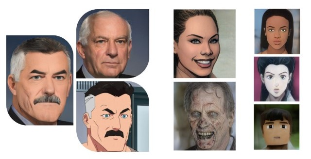

# Mixed Style Face Transformation with StyleGAN2 and pixel2style2pixel (pSp)

### This repo introduces the method for creating a mixed style face generation model based on StyleGAN2 and pSp
### Some of my results are included at the end 

## Method
**Train a new StyleGAN2 model**
- Get a StyleGAN2 model pretrained on FFHQ dataset, and prepare a dataset from which you wish to transfer features
- Train a new StyleGAN2 model on the pretrained StyleGAN2 model with your dataset
- Use style blending to mix features from the FFHQ model and your new model, we will call this the **blended model**
- Change the alpha parameter until the blended model produce desired results

**Create data pairs for training pSp**
- Generate images with the FFHQ model and the blended model with the same random seed, pair them up. The image from FFHQ model will represent the original image, and the image from blended model will represent the desired result after processing the original image through the network.
- Pick good results from the generated data

**Train pSp**
- Use the data pairs from last step to train a pSp model, use FFHQ StyleGAN2 model as the original encoder and the blended model as the decoder

## Results

### American Comic Style
Trained on Kaggle comic faces dataset by petya: https://www.kaggle.com/defileroff/comic-faces-paired-synthetic

Trained on *Invincible* TV series by Amazon Studios

### Zombie Style (Halloween Special)
Trained on online pictures of Halloween masks and special makeups

### Anime Style (*JoJo's Bizzare Adventure*)

### Minecraft Style (*My Three-Body*)

## Insights
**Data has substantial effect on the training results! Make sure:**
- Your training data is aligned based on feature points (I used feature points for eyes, nose, and chin) 
- Clean your dataset. Avoid blurry pictures, shadows, side-faces, closed eyes, exaggerated facial expressions. If your dataset contains too many irregular images, some undisired features might be learned by the model. 

- Use an attribute dataset if you want a specific feature but have too little data for the model to learn such feature.

**Batch Size matters.**
- If your GPU doesn't have enough memory, using a batchsize smaller than 8 may not yield to results as good as using a larger batch size

**Take advantage of pSp** 
- pSp sometimes gets rid of artifacts from StyleGAN2 models since it finetunes your model based on the input data pair. If you are having a hard time training or blending the perfect StyleGAN2 model, try picking some good generated results and feed them into pSp.

## References
[StyleGAN2_pytorch](https://github.com/rosinality/stylegan2-pytorch)

[pixel2style2pixel(pSp)](https://github.com/eladrich/pixel2style2pixel)
